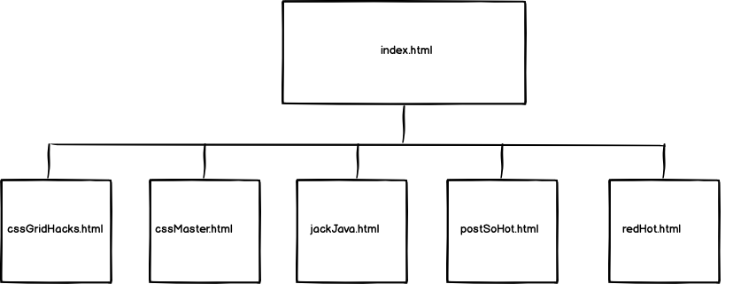
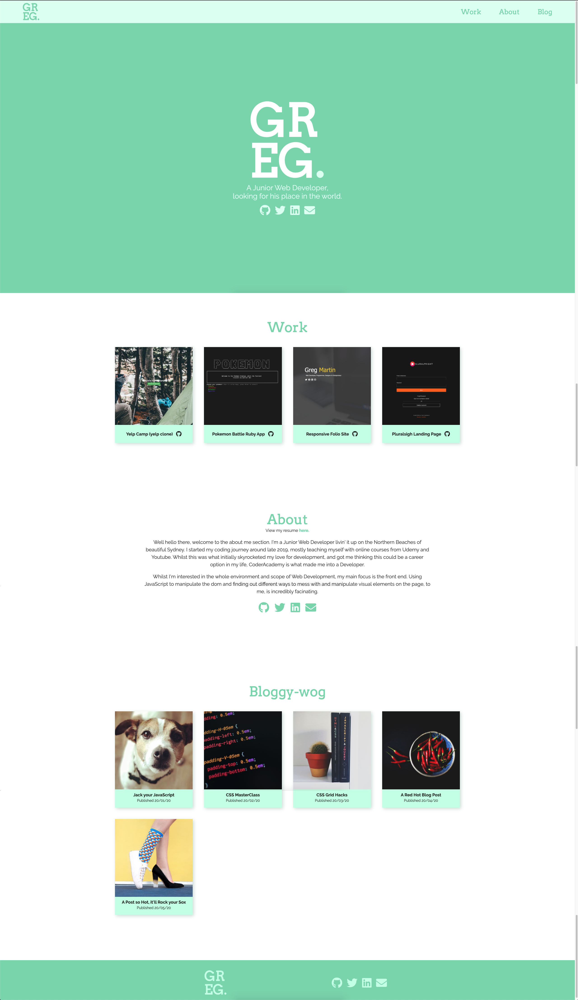

# Greg Martin Portfolio Website - T1A3
Website: [https://gregm1991.github.io/GregM1991-Portfolio_Site/](https://gregm1991.github.io/GregM1991-Portfolio_Site/)

GitHub: [https://github.com/GregM1991/GregM1991-Portfolio_Site](https://github.com/GregM1991/GregM1991-Portfolio_Site)

# Purpose
I'm getting out there into the world, via the internet! I've hopped out of my static home on the side of the highway, and jumped into a ratty old 1994 Ford Dodger, finally on the move, albeit slowly at this stage. 

The purpose of this site is to get me out there, to get eyeballs on the fact that I exist as a developer. A portfolio is necessary and key to getting a job, or even just looked over, in the Development industry. Not to mention, this is literally our job, what we do, if we can't build a great website for ourselves in a capacity for getting hired, then can we really produce a great website for a client? I think not.

# Functionality & Features
## Splash page
A lovely page to open up to with my logo, and links to my GitHub, LinkedIn, Twitter and to E-mail.
## Navigation and Header/Footer
My navigation consists of links to points on my index.html file that correspond to that link. My Footer consists of links again to my Industry pages.
## Portfolio Items
Opening up on my portfolio items is something I believe is key to a quality portfolio. It allows potential employers and clients to navigate to my work (the thing they most want to see) as quickly as possible, with as little hassle as possible.
## About Me
A short blurb in case employers get past my portfolio and want to actually learn a little bit about who I am.
## Blog Posts
Who doesn't like to read some blogs? Linking to articles I've 'written' to showcase my knowledge on certain subjects.
## Consistency of Style Throughout the Site
People don't want to be disoriented when they visit your site. Good design is a necessity in creating a successful website, so I tried my best to implement that here. A simple palette allows the portfolio items to stand out without too much visual noise. This style is carried over to the blog posts as well.
## Responsive
Resize the image, I dare you! Compatible at any size, for your on-the-go convenience. You're welcome you go getter, you. 
## SRI Protected. 
No one's intercepting these files for corruption! We remain as pure as a snowflake here on my Portfolio.

# Sitemap
The website is linked within itself mostly, to only break out to blog posts.

# Screenshot

# Target Audience
It's pretty straight forward that the audience for this project is Employers and potential clients, recruiters and pretty much anyone that has the potential to get me into the industry, and to get me earning money as a Web Developer. It's targeted to them as the content of my site is purely selling my skills and knowledge of the Web Development industry.

# Tech Stack
The tech stack used for this website is HTML, CSS and static page web-hosting with GitHub pages.